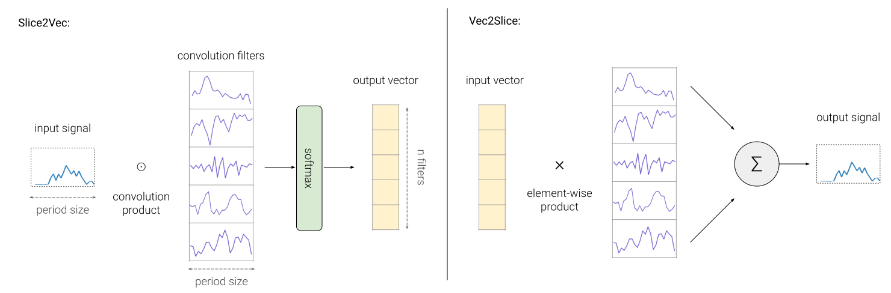
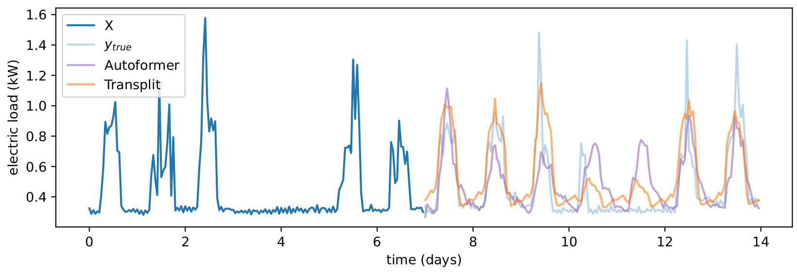
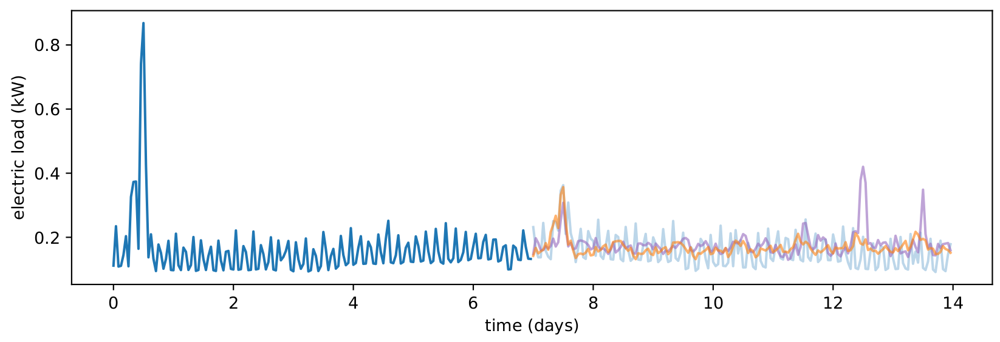
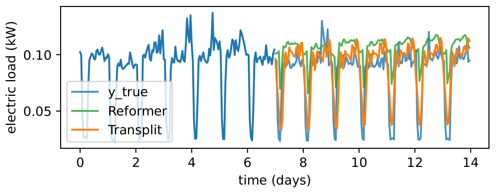

<!--  -->
# Transplit

**Efficient Energy Demand Forecasting at Scale**

Lightweight model for large scale applications, that achieves the performance of state-of-the-art time series transformers, while being **50** to **100** times smaller and faster.

## The Transplit Architecture

Transplit is a time series transformer with an additional module
that allows to shorten the sequence to process, called **SVS** (Slice to Vector to Slice).

The input sequence is split into slices of fixed length (e.g. 24 hours),
and each slice is transformed into a vector, then representing a single day.

This allows the model to reason in a day-by-day basis, and to be able to process large sequences.
The outputed vectors are eventually converted back to slices and concatenated to form the final output.





## Some results

We consider a classical training configuration, also used in 
using the Adam optimizer with a learning rate of 1e-4, divided by 2 at every epoch. 
All experiments are run on an NVIDIA RTX A2000 4GB with a batch size of 12. The CPU used for time measurement is an Intel i7 11th generation.

Datasets used:
- [ECL](https://archive.ics.uci.edu/ml/datasets/ElectricityLoadDiagrams20112014) (Electric consumption load)
- IND, industrial private dataset from a grid operator

Other models used:
- [Autoformer](https://github.com/thuml/Autoformer/)
- [Informer](https://github.com/zhouhaoyi/Informer2020)
- [Reformer](https://arxiv.org/abs/2001.04451)
- [Transformer](https://arxiv.org/abs/1706.03762)

|     | **Transplit** | **Autoformer**  | **Informer**  | **Reformer**  | **Transformer**  |
| --------- | --------- | --------- | --------- | --------- | --------- |
**# of parameters** | 183,616     | 10,505,217    | 11,306,497    | 5,782,529     | 10,518,529    |
| **Training time:** | --- | --- | --- | --- | --- |
**ECL**: train. with **GPU** | 3m02s    | 4h16m      | 1h53m      | 4h13m     | 2h51m    |
**IND**: train. with **GPU** | 21m13s   | 1d 12h15m  | 19h37m     | 20h56m    | 1d 9h00m |
**ECL**: train. with **CPU** | 2m47s    | 1d 18h01m  | 17h11m     | 1d 13h49m | 1d 3h01m |
**IND**: train. with **CPU** | 32m05s   | 20d 21h59m | 8d 13h21m  | 18d 19h47m | 13d 10h42m |






## Getting Started

First clone this container and cd into it:
```shell
git clone https://github.com/serval-uni-lu/transplit && cd transplit
```

### Native installation

**Requirements**  
- Python **3.6+**
- Pytorch **1.10+**

**Optional**  
- PyTorch installed with a GPU to run it faster ;)

Install dependencies with:
```shell
pip install -r requirements.txt
```

**Download** the data with:
```shell
python utils/download_data.py
```

### Docker usage
If you don't want to install Transplit natively and want an easy solution, you can use Docker.

First pull the Nvidia's PyTorch image:
```shell
docker pull docker pull nvcr.io/nvidia/pytorch:22.05-py3
```

If you want to run the container with GPU, you will need to setup Docker for it
by installing the `nvidia-container-runtime` and `nvidia-container-toolkit` packages. 

Then run the container from the transplit directory:
```shell
docker run -it --rm --gpus all --name transplit -v $(pwd):/workspace nvcr.io/nvidia/pytorch:22.05-py3
```

Once in it, install the dependencies with:
```shell
pip install -r requirements.txt
```

And download the data if not already done.

### Run experiments

We recommend to run the experiments via IPython,
so that you can access the Python environment and debug it.
So, simply run `ipython`, then:
```ipython
%run main.py --is_training 1 --root_path ./dataset/electricity/ --data_path electricity.csv --model_id ECL_720 --model Transplit --batch_size 12 --train_epochs 3 --features SA --seq_len 720 --pred_len 720 --e_layers 1 --d_layers 1 --period 24 --n_filters 512 --d_model 64 --d_ff 256 --des 'Exp'
```
You can do the same for other models by picking the commands in [`models.sh`](./models.sh).


## Acknowledgement

Thanks to the Informer and Autoformer authors for their valuable work and their useful repositories:

https://github.com/thuml/Autoformer

https://github.com/zhouhaoyi/Informer2020

More info in [LICENSE](LICENSE) and [NOTICE](NOTICE).
