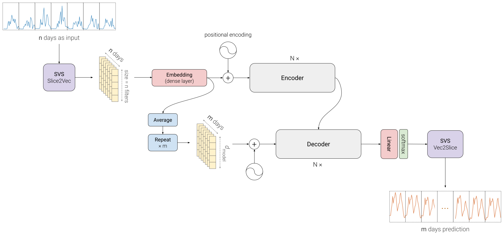

[//]: # ()
# Transplit

**Efficient Energy Demand Forecasting at Scale**

Lightweight model for large scale applications, that achieves the performance of state-of-the-art time series transformers, while being **50** to **100** times smaller and faster.

## The Transplit Architecture




## Getting Started

First clone this container and cd into it:
```shell
git clone https://github.com/serval-uni-lu/transplit && cd transplit
```

### Native installation

**Requirements**  
- Python 3.6+
- Pytorch 1.10+

**Optional**  
- PyTorch installed with a GPU to run it faster ;)

Install dependencies with:
```shell
pip install -r requirements.txt
```

**Download** the data with:
```shell
python utils/download_data.py
```

### Docker usage
If you don't want to install Transplit natively and want an easy solution, you can use Docker.

First pull the Nvidia's PyTorch image:
```shell
docker pull docker pull nvcr.io/nvidia/pytorch:22.05-py3
```

If you want to run the container with GPU, you will need to setup Docker for it
by installing the `nvidia-container-runtime` and `nvidia-container-toolkit` packages. 

Then run the container from the transplit directory:
```shell
docker run -it --rm --gpus all --name transplit -v $(pwd):/transplit nvcr.io/nvidia/pytorch:22.05-py3
```

Once in it, install the dependencies with:
```shell
pip install -r requirements.txt
```

And download the data if not already done.

### Run experiments

We recommend to run the experiments via IPython,
so that you can access the Python environment and debug it.
So, simply run `ipython`, then:
```ipython
%run run.py --is_training 1 --root_path ./dataset/electricity/ --data_path electricity.csv --model_id ECL_720 --model Autoformer --batch_size 12 --train_epochs 3 --features SA --seq_len 720 --pred_len 720 --e_layers 1 --d_layers 1 --d_model 64 --d_ff 256 --des 'Exp'
```
You can do the same for other models by picking the commands in [`models.sh`](./models.sh).


## Acknowledgement

Thanks to the Informer and Autoformer authors for their valuable work and their useful repositories:

https://github.com/thuml/Autoformer

https://github.com/zhouhaoyi/Informer2020

More info in [LICENSE](LICENSE) and [NOTICE](NOTICE).